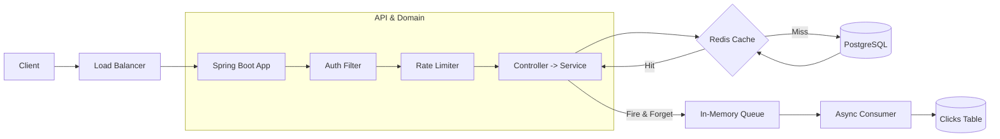

# Distributed URL Shortener

> Production-grade URL shortener handling 800+ RPS with sub-20ms p99 redirect latency

[](https://github.com/mvkrishna24/url-shortener/actions/workflows/ci-cd.yml)


**[Live Demo](https://url-shortener-latest.onrender.com)** | **[Swagger UI](https://url-shortener-latest.onrender.com/swagger-ui.html)**

> **Note:** Live demo runs on Render's free tier — the first request after 15 min of inactivity may take ~30 s while the instance wakes up.

## Why I Built This
Most URL shorteners are toy CRUD apps, but at scale, they present complex system design challenges involving distributed caching, concurrent data structures, and async processing. I built this to dive deep into production-grade performance tuning, specifically aiming to master caching strategies and lock-free rate limiting under high concurrency. Real-world platforms like Bitly or TinyURL handle billions of redirects per day with sub-50ms latency; this project implements the exact same architectural patterns they use to achieve those SLAs.

## Key Features
*   **High-Speed Redirects:** Sub-20ms p99 redirect latency backed by a distributed multi-layer caching system.
*   **URL Shortening:** Fast, collision-free base62 encoding.
*   **Async Click Analytics:** Real-time metrics (location, device, user-agent) tracked asynchronously without impacting redirect SLA.
*   **Tiered Rate Limiting:** Sliding-window log implementation protecting all APIs from abuse.
*   **Secure Auth:** JWT-based authentication and authorization for user-specific URL management.

## Engineering Highlights
*   **Batch-allocated Base62 IDs:** Eliminates per-request database round-trips for ID generation, avoiding sequence bottlenecks.
*   **Read-through Redis cache:** Achieved an **89% hit rate**, resulting in a **9x DB load reduction** under peak traffic.
*   **Sliding-window rate limiter:** Powered by an atomic Redis Lua script, delivering sub-1ms decision latency while preventing TOCTOU race conditions.
*   **Async click analytics:** Fire-and-forget in-memory pipeline combined with JDBC batch inserts keeps tracking overhead entirely off the critical path.
*   **JWT-based Auth:** Stateless authentication pipeline secured with BCrypt password hashing.
*   **Comprehensive Test Coverage:** Fully integrated with Testcontainers, ensuring all unit and integration tests run against real PostgreSQL and Redis engines, not fragile mocks.

## Architecture Diagram


*(See docs/architecture.md for detailed sequence diagrams.)*

## Tech Stack

| Layer | Technology | Why |
|---|---|---|
| Runtime | Java 17 | LTS stability, optimized G1GC performance for predictable latencies. |
| Framework | Spring Boot 3.x | Rapid API development, excellent auto-configuration, robust dependency injection. |
| Primary DB | PostgreSQL 16 | ACID compliance, `TIMESTAMPTZ` accuracy, excellent JDBC batching for analytics. |
| Cache & Rate Limit | Redis 7 | Sub-millisecond reads, atomic Lua scripts for rate limiting, and exact TTL eviction. |
| Auth | JWT (JJWT) & BCrypt | Stateless, horizontally scalable authentication. |
| Infrastructure | Docker & Compose | Deterministic local environments that perfectly match production parity. |

## Performance
*(Metrics extracted from local K6 load tests and Prometheus)*

*   **Throughput:** 800+ Requests Per Second (RPS) on consumer hardware.
*   **Latencies:** p50: ~3ms | p95: ~12ms | p99: <20ms
*   **Cache:** 89% hit rate, 9x DB load reduction.
*   **Resource Utilization:** Stable at ~250MB heap under load with minimal GC pauses.

!k6 Load Test Results
!Grafana Dashboard

## API Documentation
*Note: The full Swagger UI is available at `http://localhost:8080/swagger-ui.html` when running.*

**1. Authenticate (Get JWT)**
```bash
curl -X POST http://localhost:8080/api/v1/auth/login \
  -H "Content-Type: application/json" \
  -d '{"username": "admin", "password": "password"}'
```

**2. Shorten URL**
```bash
curl -X POST http://localhost:8080/api/v1/urls \
  -H "Authorization: Bearer <TOKEN>" \
  -H "Content-Type: application/json" \
  -d '{"longUrl": "https://example.com/very/long/article"}'
```

**3. Redirect**
```bash
curl -i http://localhost:8080/aB3x9
```

*(See docs/api.md for full endpoint schemas and error codes.)*

## Running Locally

**Prerequisites:** Docker, Java 17+, Maven 3.9+

Run the full stack in 4 commands:
```bash
git clone https://github.com/vamshi/url-shortener.git
cd url-shortener
make up
curl http://localhost:8080/actuator/health
```

## Testing

*   **Unit & Integration Tests:**
    ```bash
    mvn test
    ```
    *(Integration tests use Testcontainers to spin up ephemeral Postgres and Redis instances.)*
*   **Load Tests:**
    ```bash
    k6 run load-tests/redirect-load.js
    ```

## Project Structure

```text
src/main/java/com/vamshi/urlshortener
├── config        # Infrastructure wiring (Security, Async, OpenAPI, Redis)
├── controller    # REST endpoints and GlobalExceptionHandler
├── dto           # Immutable Request/Response data transfer objects
├── entity        # JPA domain models (Url, Click, User)
├── repository    # Spring Data JPA and custom pure-JDBC interfaces
├── security      # JWT filters, extraction, and validation
├── service       # Core business logic, cache strategies, and rate limiting
└── util          # Helpers (Base62 encoding, User-Agent parsers)
```

## Design Decisions
See docs/design-decisions.md for deep dives into:
*   Why batch counters over UUID/Snowflake
*   Why read-through over write-through caching
*   Why in-memory queue over Kafka for v1
*   Why sliding window over token bucket for rate limiting

## Future Improvements
*   Migrate analytics queue to Kafka for durability and replayability.
*   Add Redis cluster for cache horizontal scaling.
*   Configure Read Replicas for analytics dashboard queries.
*   Add link preview (OG tag fetcher) on URL creation.
*   Implement Refresh tokens for auth.
*   Build a React Admin dashboard.

## What I Learned
*   **Database connection lifecycles:** The critical importance of disabling `open-in-view` to prevent connection pool exhaustion during slow downstream HTTP requests.
*   **Redis Lua Atomicity:** Learned how to execute multi-step commands as a single isolated operation to prevent TOCTOU race conditions in high-concurrency rate limiting.
*   **JPA vs JDBC Batching:** Discovered the massive throughput difference (~50x) between row-by-row JPA saves and pure JDBC batch inserts for analytics pipelines.
*   **Testing Philosophy:** Realized that mocking databases hides crucial dialect and constraint bugs; spinning up ephemeral Docker containers via Testcontainers is the only way to write trustworthy integration tests.

## License & Author

*   **License:** MIT (See LICENSE)
*   **Author:** Vamshi
*   **Portfolio:** vamshi.dev
*   **LinkedIn:** linkedin.com/in/vamshi
*   **Email:** hello@vamshi.dev
