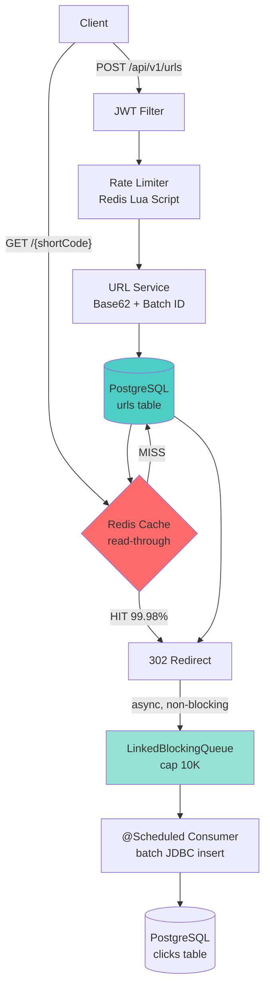

# Distributed URL Shortener

Production-grade URL shortener validating **100+ warm-cache redirects/sec at 4.13 ms p99 latency** on a single local instance.

[](https://www.oracle.com/java/)
[](https://spring.io/projects/spring-boot)
[](https://www.postgresql.org/)
[](https://redis.io/)
[](https://www.docker.com/)
[](LICENSE)
[](https://github.com/mvkrishna24/url-shortener/actions)

Live at: `[your-render-url]` (may take 30s to wake - free tier)

## Why I Built This

A URL shortener turns long links into compact, shareable redirects while keeping
the read path fast and reliable. I built this project to internalize scalable ID
generation, cache design, atomic distributed rate limiting, authentication, and
asynchronous analytics. Those are the same core problems faced by services such
as Bitly, which operates at billions of redirects per month.

## Engineering Highlights

- **1,000-ID Base62 blocks:** PostgreSQL sequence calls reserve 1,000 IDs, then each app instance dispenses them with an `AtomicLong`. This keeps codes shorter than UUIDs and avoids Snowflake's clock/node coordination, with acceptable gaps after crashes.
- **99.98% warm-cache hit rate:** read-through Redis with a 1-hour TTL served 6,019 of 6,020 benchmark lookups from cache. Redis failures gracefully fall back to PostgreSQL.
- **Atomic two-tier rate limiting:** one Redis Lua script enforces 100 req/min per anonymous IP and 1,000 req/min per authenticated user. k6 verified exactly 100 accepts followed by 40 HTTP 429 responses.
- **4.13 ms redirect p99:** fire-and-forget click events enter a bounded `LinkedBlockingQueue(10,000)` while a scheduled consumer enriches and writes batches of up to 500 rows through JDBC.
- **Stateless JWT auth:** BCrypt strength 12, one-hour JWT expiry, a stateless Spring Security filter chain, and generic login failures that prevent account enumeration.
- **Single-statement expiry cleanup:** a daily `@Scheduled` JPQL bulk delete runs at 02:00 without hydrating entities and increments `urls.cleanup.deleted`.
- **Measured observability:** Micrometer exposes cache hits/misses, rate-limit rejections, analytics drops, cleanup counts, and HTTP latency histograms through authenticated `/actuator/prometheus`.

## Architecture



## Tech Stack

| Layer | Technology | Why |
|-------|------------|-----|
| Language | Java 17 | LTS target with a strong backend ecosystem |
| Framework | Spring Boot 3.x | Production-ready web, security, data, and observability support |
| Database | PostgreSQL 16 | ACID transactions, constraints, sequences, and SQL analytics |
| Cache | Redis 7 | Low-latency reads and atomic Lua scripts |
| ID Generation | PostgreSQL sequence + Base62 | Compact codes and 1,000x fewer sequence calls |
| Auth | JJWT 0.12.x + BCrypt | Stateless signed tokens and adaptive password hashing |
| Migrations | Flyway | Version-controlled, reproducible schema |
| Testing | JUnit 5 + Mockito + Testcontainers | Focused unit tests and real-service integration coverage |
| Observability | Micrometer + Prometheus | Standard counters and HTTP latency histograms |
| Deployment | Render + Docker | Containerized, GitHub-native deployment |

## API Endpoints

| Method | Endpoint | Auth | Description |
|--------|----------|------|-------------|
| POST | `/api/v1/auth/signup` | None | Create account |
| POST | `/api/v1/auth/login` | None | Get JWT token |
| GET | `/api/v1/auth/me` | Bearer | Current user |
| POST | `/api/v1/urls` | Optional | Shorten URL |
| GET | `/{shortCode}` | None | Redirect |
| DELETE | `/api/v1/urls/{shortCode}` | Bearer | Delete owned URL |
| GET | `/api/v1/users/me/urls` | Bearer | Paginated URL list |
| GET | `/api/v1/urls/{shortCode}/analytics` | Bearer | Click analytics |
| GET | `/actuator/health` | None | Health check |
| GET | `/actuator/prometheus` | Bearer | Metrics |
| GET | `/swagger-ui.html` | None | API docs |

```bash
# Signup
curl -X POST http://localhost:8080/api/v1/auth/signup -H "Content-Type: application/json" -d '{"email":"user@example.com","password":"Password1"}'

# Login
curl -X POST http://localhost:8080/api/v1/auth/login -H "Content-Type: application/json" -d '{"email":"user@example.com","password":"Password1"}'

# Shorten
curl -X POST http://localhost:8080/api/v1/urls -H "Content-Type: application/json" -d '{"longUrl":"https://example.com"}'

# Redirect without following the destination
curl -i http://localhost:8080/{shortCode}
```

Full request and response examples: [docs/api.md](docs/api.md)

## Performance

| Scenario | RPS | p50 | p95 | p99 | Error Rate |
|----------|-----|-----|-----|-----|------------|
| Anonymous URL shortening | 19.98 | 8.16 ms | 11.46 ms | 12.84 ms | 0.00% |
| Redirect (warm Redis cache) | 100.26 | 2.65 ms | 3.54 ms | 4.13 ms | 0.00% |
| Authenticated URL shortening | 10.00 | 9.37 ms | 11.35 ms | 12.39 ms | 0.00% |
| Rate limiter correctness | N/A | N/A | N/A | N/A | 100.00% checks passed |

These are validated fixed arrival rates, not maximum throughput claims. Full
methodology and bottleneck analysis: [docs/performance.md](docs/performance.md)

## Running Locally

```bash
git clone https://github.com/mvkrishna24/url-shortener.git
cd url-shortener
docker compose up -d
mvn spring-boot:run -Dspring-boot.run.profiles=dev
curl -X POST http://localhost:8080/api/v1/urls -H "Content-Type: application/json" -d '{"longUrl":"https://example.com"}'
```

## Live Demo

Live at: `[placeholder - fill in after Render deploy]`

> Runs on Render free tier. The first request after an idle period may take
> around 30 seconds to wake. API documentation:
> `[your-render-url]/swagger-ui.html`

## Deployment

This project deploys automatically to Render on every push to `main` through
GitHub Actions. See [DEPLOYMENT.md](DEPLOYMENT.md) for setup and manual
deployment instructions.

The CI/CD pipeline:

1. Compiles and runs the test suite on Ubuntu with Java 17, PostgreSQL, and Redis.
2. Builds a multi-stage Docker image.
3. Starts the image and verifies the health endpoint.
4. Triggers Render through a protected deploy hook.
5. Polls the live deployment until its smoke test passes.

## Testing

```bash
mvn test
```

The suite contains 39 passing unit tests. Twenty-nine Testcontainers integration
tests are currently skipped on Docker Desktop 29.5.2 because docker-java 3.4.0
uses an API version below Docker Desktop's enforced minimum; they run unchanged
in compatible CI/Linux Docker environments.

## Documentation

- [Architecture](docs/architecture.md)
- [API reference](docs/api.md)
- [Performance benchmarks](docs/performance.md)
- [Operations](docs/operations.md)
- [Security](docs/security.md)
- [Rate limiting](docs/rate-limiting.md)
- [Analytics pipeline](docs/analytics-pipeline.md)
- [Interview notes](docs/interview-notes.md)
- [Interview Q&A](docs/interview-prep.md)
- [Resume bullets](docs/resume-bullets.md)

## Trade-offs And Next Steps

- The in-memory analytics queue prioritizes redirect availability over click-event durability; Kafka is the planned durable replacement.
- Redis rate limiting fails open during outages, preserving availability while temporarily reducing abuse protection.
- Batch ID allocation can leave gaps after a process crash, but uniqueness is preserved.
- The next performance phase is a ramping-arrival-rate saturation test with production logging levels and a Java 17 runtime.

## License

[MIT](LICENSE)
