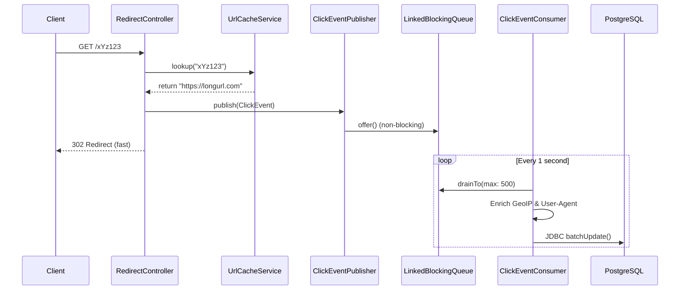

# Analytics Pipeline Architecture

This document details the async processing pipeline used to track URL clicks without impacting the `< 20ms` redirect latency SLA.

## Architecture / Sequence

## Core Technical Decisions

1. **Why `CallerRunsPolicy` over `AbortPolicy`?**
   For standard `@Async` methods, `CallerRunsPolicy` introduces back-pressure. Rather than throwing an exception (`AbortPolicy`) and losing tasks, it forces the producing thread (HTTP thread) to execute the task. However, for our click events, we explicitly opted for a manual `LinkedBlockingQueue` bounded to 10,000 elements. If the DB stalls and the queue fills up, we simply drop the analytic event (`queue.offer()` returns false). It is fundamentally better to drop click telemetry than to degrade redirect latency.

2. **Why Batch by *Both* Size (500) and Time (1 sec)?**
   - **Time (every 1s):** In low-traffic periods, it might take minutes to reach 500 clicks. Waiting for the buffer to fill would result in stale dashboards.
   - **Size (drain 500):** During traffic spikes, we process chunks of 500. This ensures memory stays bounded and DB transactions are perfectly sized for throughput.

3. **Why JDBC Batch `batchUpdate` vs JPA `.saveAll()`?**
   JPA processes `saveAll()` as individual `INSERT` statements with round-trips unless extremely carefully configured (`hibernate.jdbc.batch_size` + disabling identity generation). By bypassing JPA and using Spring's `JdbcTemplate.batchUpdate()`, we pack 500 rows into a single network packet to PostgreSQL. 500 individual inserts takes ~250ms (0.5ms * 500 round-trips). A batched insert of 500 rows takes ~5-10ms. A 50x performance gain.