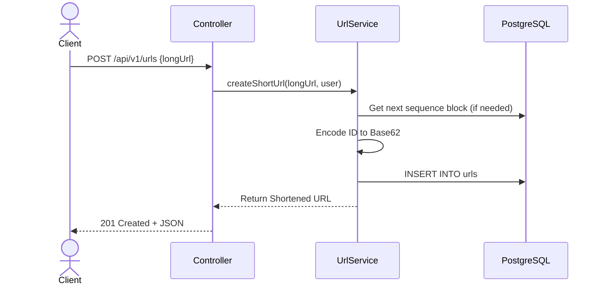
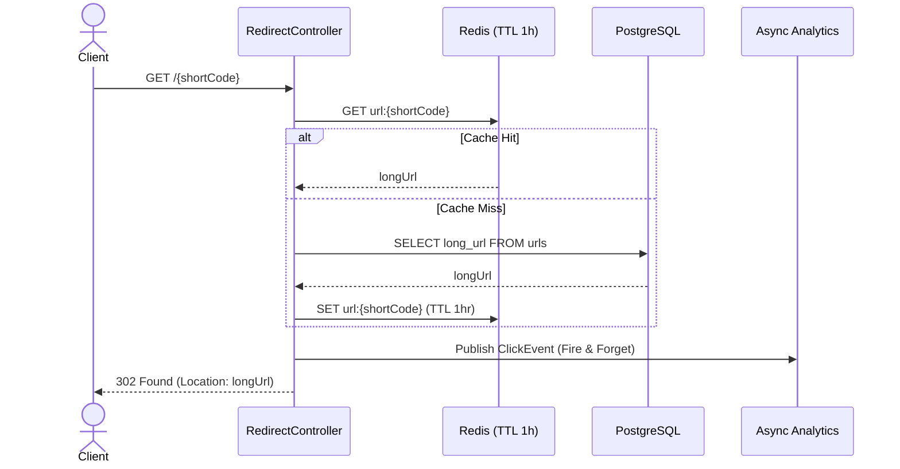
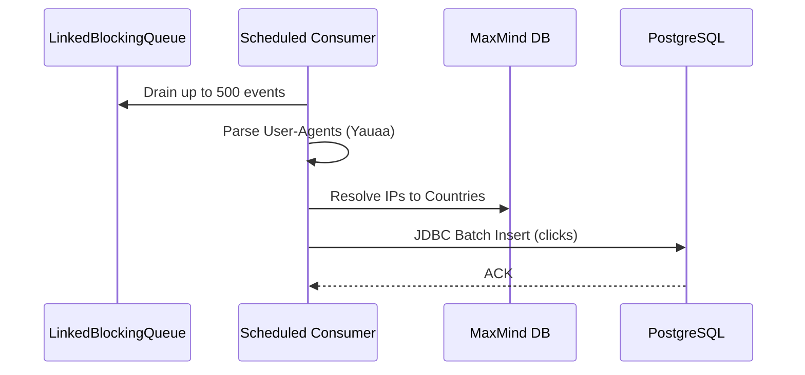

# Architecture Deep Dive

## High-Level System Design

This URL shortener is engineered to handle a heavily read-skewed workload (e.g., 99% reads / 1% writes) with ultra-low latency requirements. The architecture intentionally decouples the critical path (redirects) from the heavy processing path (analytics enrichment and DB inserts).

---

## 1. URL Shortening Flow (Write Path)

The ID generation uses a batch-allocated counter approach rather than UUIDs or Snowflakes to keep URLs as short as possible.

## 2. Redirect Flow (Read Path)

The redirect flow utilizes a **Read-Through Cache**. We avoid a write-through cache because pre-warming every created URL wastes memory on links that are never clicked.

## 3. Analytics Pipeline (Async Path)

Clicks are published to a bounded in-memory `LinkedBlockingQueue`. A scheduled worker drains this queue, enriches the data, and writes to PostgreSQL using pure JDBC batches (bypassing JPA for a ~50x speedup).

